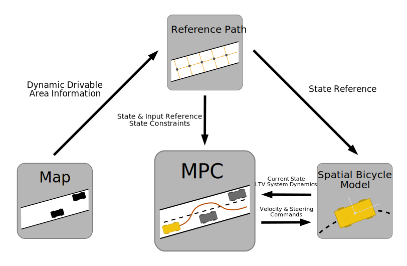

# Multi-Purpose MPC

1. [Introduction](#introduction)
2. [Implementation Details](#implementation-details)
   1. [Map](#map)
   2. [Reference Path](#reference-path)
   3. [Spatial Bicycle Model](#spatial-bicycle-model)
   4. [Model Predictive Controller (MPC)](#model-predictive-controller)
3. [How-To](#how-to)
4. [Limitations and Outlook](#limitations-and-outlook)

## Introduction

In this repository you find an implementation of a multi-purpose Model Predictive Controller. The controller was implemented as a contribution to the [Automatic Control Project Course (EL2425)](https://www.kth.se/student/kurser/kurs/EL2425) at KTH Royal Institute of Technology, Stockholm. 
The developed algorithm was tested on a 1:10 RC car provided by [KTH Smart Mobility Lab](https://www.kth.se/dcs/research/control-of-transport/smart-mobility-lab/smart-mobility-lab-1.441539). The test scenarios comprised the following three tasks:

1. Reference Path Tracking
2. Time-Optimal Driving
3. Obstacle Avoidance

The controller is implemented in a way that enables its applicability to all three tasks by merely tuning the weight matrices of the underlying optimization problem. The illustration below shows the obstacle avoidance task in simulation.

The rest of this readme is structured as follows. In [Section 2](#implementation-details) we will present an overview of the entire system and discuss all fundamental components of the implementation in detail. In [Section 3](#how-to) we will provide guidelines for using the implementation in simulation and practice. [Section 4](#limitations-and-outlook) will be dedicated to analyzing limitations of the current version of the controller and outline potential extensions of the implementation.

<p align="center">

</p>

## Implementation Details

The multi-purpose control framework presented in this repository consists of four main components. These components are intended to make the implementation as modular as possible, facilitating extensions to certain components without having to alter the overall structure of the framework. An illustration of the components and their interaction is displayed below.

<p align="center">
  
</p>

### Map 

The Map class is a handler for the Occupancy Grid Map of the environment. The map is represented as a binary array classifying each cell as either free or occupied. Moreover, the Map class can act as a wrapper around a potential obstacle detection algorithm. By incorporating e.g. LiDAR measurements and updating the Occupancy Grid Map accordingly, new information about the drivable area can be passed to the Reference Path object.

### Reference Path

The Reference Path class is where most of the computations are performed. Ultimately, this is where all the available information is aggregated and processed before passing it to the Model Predictive Controller. In our simulation as well as the real-world test scenario, the entire reference path is known in advance. Consequently, the object contains a list of waypoints along the path at a specified resolution. Each waypoint contains information about its location and orientation within the world coordinate frame as well as the local curvature of the reference path. Furthermore, a speed profile can be computed that associates a reference velocity with each waypoint based on a maximum velocity of the car and the curvature of the path.
In order to be able to account for obstacles in the environment, each waypoint has an additional attribute which contains information about the width of the drivable area on both sides of the center-line. This information is computed dynamically from the information provided by the Map class. Consequently, the Reference Path object contains all necessary information to track the reference path while respecting constraints imposed by obstacles in the environment.

### Spatial Bicycle Model

To model the dynamics of the car, we employ a simple Kinematic Bicycle Model. We transform the model into the spatial domain in order to be able to formulate the Path Tracking problem more intuitively by taking as state variables the deviation from the provided center-line in terms of location as well as orientation. Besides the more intuitivate formulation of the problem, the reformulation of the model allows for including time as a state variable and perform Time-Optimal Driving. 
The implementation of the Spatial Bicycle Model is based on [Stability Conditions for Linear Time-Varying Model Predictive Control in Autonomous
Driving](http://urn.kb.se/resolve?urn=urn:nbn:se:kth:diva-220576) by Lima, Mårtensson and Wahlberg as well as [Towards Time-Optimal Race Car Driving Using Nonlinear MPC in Real-Time](https://www.researchgate.net/profile/Robin_Verschueren/publication/269860931_Towards_Time-Optimal_Race_Car_Driving_Using_Nonlinear_MPC_in_Real-Time/links/56ab66e108aeadd1bdce436b/Towards-Time-Optimal-Race-Car-Driving-Using-Nonlinear-MPC-in-Real-Time.pdf?origin=publication_detail) by Vershuren, De Bruyne, Zanon and Frash. For more details, please consult the original publications.
In our implementation, we use the non-linear Spatial Bicycle Model for the simulation of the car. For the computation of the control signals, we resort to a Linear-Time-Variant formulation of the model based on the reference path.

### Model Predictive Controller

The Model Predictive Controller is based on a Linear Time-Variant model of the car dynamics. The control signal is recomputed at a specified frequency. Based on the current position of the car, the Spatial Bicycle Model is linearized around the waypoints on the path. The horizon of the optimization problem corresponds to the number of predicted waypoint and can be transformed into a prediction distance using the uniform distance between the waypoints. 
The weight matrices of the cost function to be minimized allow for influencing the expected behavior of the car. Reference Path Tracking can be performed using large weights on the deviation from the center-line. Time-Optimal Driving, on the other hand, can be achieved by penalizing the time the car needs to arrive at the last waypoint of the horizon. This objective corresponds to maximizing the velocity of the car along the reference path, instructing the car to cut corners whenever possible. Finally, obstacle avoidance is performed by shifting the reference value away from the center-line towards the center of the detected drivable area. Thus, the car deviates from the original reference path in order to avoid obstacles with a maximum margin.

## How-To

The implementation is based on a small set of libraries. For the optimization problem of the MPC we chose [OSQP](https://osqp.org) due to its simplicity and efficiency. Below we provide a list of all required libraries.

```
osqp
numpy
scipy
skimage
matplotlib
```

### Simulation

To start the simulation, go to ```simulation.py```. This script provides a template for loading a map image, specifying a reference path, setting up the motion model and running the simulation. This script was used to generate the GIF displayed above. All simulation parameters can be changed in this script, allowing to expolore the capabilities of the algorithm in different scenarios. Furthermore, the environment can be modified by adding obstacles and boundaries to the map. The modular structure of the implementation allows for an intuitive setup of the simulation, centered around the two functions ```u = mpc.get_control()``` and ```car.send_control(u)```.

### Real-World Testing

In order to test the controller on a real car, we adapt certain components of the implementation to a ROS framework provided for the communication with the vehicle. Again, the modular structure facilitated a quick adaptation. For example, the pose attribute of the spatial bicycle model subscribes to the topic published to by the localization node. The map object is modified by an obstacle detection algorithm that subscribes to the LiDAR data collected by the car. Furthermore, the Spatial Bicycle Model is modified to include a low-level control interface that sends the computed control signals to the respective actuators. We chose not to include the code for the real-world test in this repository as most of the code is tailored towards the proprietary software of the RC car.

## Limitations and Outlook

The test scenarios, in simulation as well as real-world, provide valuable insights into limitations of the controller and illustrate how modifications to the algorithm might improvide performance. The greatest limitation is to be seen in the Kinematic Bicycle Model which doesn't account for a number of physical effects such as torque, traction and tire slip. Moreover, the car is assumed to be velocity-controlled, neglecting the dynamics of the low-level speed controller. We are looking to extend the implementation to include a dynamic bicycle model in the future. We expect a more advanced model to significantly increase the performance on Time-Optimal Driving. Using the current model, optimality corresponds to finding the shortest path. The algorithm is expected to display much more realistic behaviour upon the inclusion of additional physical effects.
A second limitation is related to the task of obstacle avoidance. The avoidance maneuver is entirely based on modifying the constraints of the optimization problem, limiting the allowed deviation from the center-line to the drivable area. This algorithm proves to work very well in simulation. However, uncertainties in the LiDAR measurements which lead to spurious elements in the dynamically updated map data, can lead to inconsitencies in the prediction. This is especially problematic in the case of obstacles that can be avoided on both sides. We are looking to introduce a more robust update of the driveable area constraints that ensures consistency across prediction horizons.
